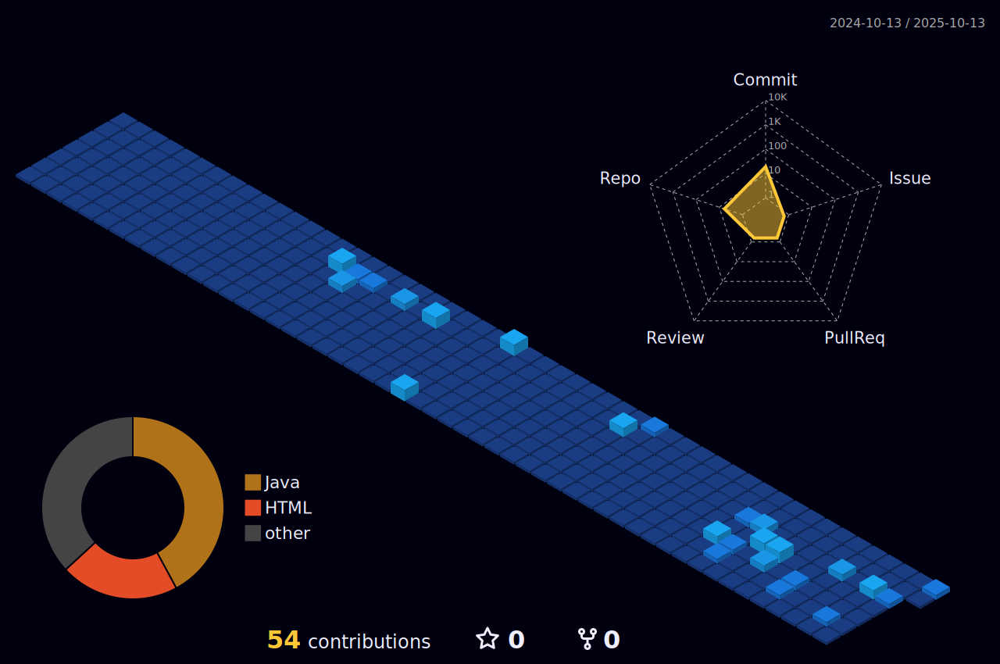

<h1 align="center">
  
</h1>

  
  **`Desenvolvedora em Formação`**
  
  

    ◊ Sempre buscando conhecimento ▵ • 
	⁖ Estudando Java ⁛
  

  

  
  
  
  

  
 ## ----------------------------------------
  
  
  

  

  
  
  
  
  

  
  
  
  
  

  
  
  

